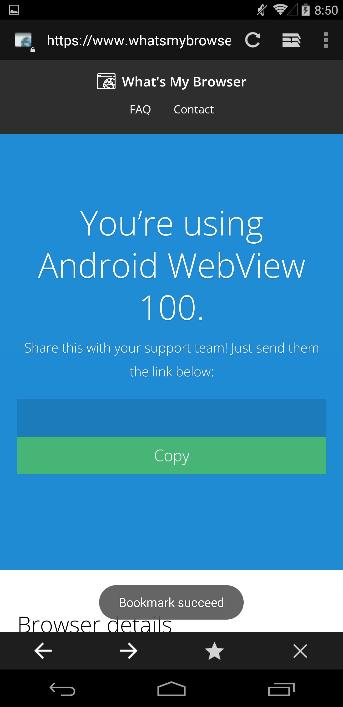

# UcKitKatWebview



An Android 4.4 (KitKat) Holo-era browser shell, styled after AOSP's legacy
Browser app, that renders pages with UCWeb's U4 engine instead of the
platform's built-in Android WebView - specifically **Chromium 100**
(`Chrome/100.0.4896.58`), not a stock KitKat-era
WebKit renderer. That means real, modern-ish web platform support running
on a 2013 OS: ARMv7 NEON-accelerated codecs/decoding, WebAssembly (including
the SIMD proposal), and the rest of what a Chromium 100 engine actually
supports - all loaded at runtime via an Xposed module, from the end user's
own, separately installed copy of UC Browser (UC浏览器 16.1.0.1261 - must have).

### Quick Setup

1. Download **UC浏览器 16.1.0.1261** from [APKPure](https://apkpure.com/uc%E6%B5%8F%E8%A7%88%E5%99%A8/com.UCMobile/download/16.1.0.1261) or your preferred provider.
2. Install and launch the app once, then navigate to any website to allow the engine components to extract and initialize.
3. Close the app completely (force stop recommended).
4. Install UcKitKatWebview.
5. Turn on Xposed Module and restart device.
6. Enjoy.

<br clear="right">

This is an independent, non-commercial research/demonstration project.
**It is not affiliated with, endorsed by, or associated with UCWeb Inc.,
Alibaba Group, or Google LLC in any way.** See [LICENSE.txt](LICENSE.txt)
and [NOTICE.txt](NOTICE.txt) before using or redistributing any part of
this project.

---

## How it works, briefly

This app does not bundle, embed, or redistribute any UC Browser file. At
runtime, as an Xposed module hooking its *own* process, it loads UC
Browser's U4 engine classes directly from the official UC Browser app
already installed on the device, entirely through Java reflection - no UC
classes are compiled against, decompiled, or shipped in this repo. See
`NOTICE.txt` for the full detail.

Requires, on the device it runs on:
- Android KitKat (4.4) or a compatible environment (this project targets
  4.4 specifically, and has been used on VMOS)
- Xposed or a compatible framework (e.g. LSPosed) installed and active
- The official UC Browser app (`com.UCMobile`) installed separately 
  (UC浏览器 16.1.0.1261)
- This app enabled as an Xposed module for its own package, then a
  reboot/soft-reboot

If any of those aren't in place, the app now tells you which one instead of
hanging on the loading spinner forever - see **Startup diagnostics** below.

---

## Features

- **Tabs** - multi-tab browsing with session persistence across restarts;
  background tabs are restored lazily (URL only) and materialize into a
  real WebView the moment you actually switch to them
- **Bookmarks** - flat folders, SQLite-backed, with search
- **History** - day-grouped, SQLite-backed, with a configurable expiry
  (1/3/6/12 months, or forever)
- **Per-domain site rules** - custom User-Agent, userscript injection
  (at document-start or once the page has loaded), and per-domain
  "hide bottom bar" override, matched by a Chrome-extension-style
  match-pattern
- **Desktop Site** - per-tab toggle in the 3-dot menu
- **Can zoom** - 3-dot menu checkbox, on by default; toggles pinch-to-zoom
  globally across all open tabs. Intentionally **not saved** - it always
  resets to "on" the next time you launch the app
- **Incognito mode** - see the important caveat right below before relying
  on this for anything
- **Settings** - General / Privacy / Site rules, in their own screens
- **Downloads** - 3-dot menu entry opens the system Download Manager app
  directly
- **About** screen
- **Startup diagnostics** - see below

---

## Incognito mode is not full private browsing

Incognito tabs here get their own private **cache, DOM storage, WebSQL
database, and saved form data/passwords** - none of that is written to disk
for an incognito tab, and none of it touches your normal tabs' data either.

**Cookies are different story: they are *not* isolated.** This engine's
`CookieManager` is a single, process-wide singleton (confirmed via smali)
with no per-tab scoping available, and this project deliberately never
calls any cookie API from anywhere - clearing or blocking cookies globally
to make incognito "more private" would also wipe or block them for every
already-open normal tab, which would be worse. The practical result:

- An incognito tab shares the **exact same cookie jar** as your normal
  tabs.
- If you're already logged into a site in a normal tab, you're logged in
  there in "incognito" too.
- Any cookie a site sets while you're browsing in incognito is **still
  there** after you close the incognito tab - same as a normal tab.

Real cookie isolation would need a second, fully separate engine instance
(effectively a second full load of the whole UC engine) - a much bigger,
native-process-level undertaking this project does not currently attempt.

**Treat "Incognito" here as meaning "doesn't keep history, cache, or form
data for this tab" - not "sites can't recognize you" or "my session is
separate."**

---

## Known gaps / not yet implemented

- **No password manager.** There's no credential save/autofill UI
  anywhere in the app. `setSavePassword`/`setSaveFormData` are only ever
  explicitly touched to turn them *off* for incognito tabs (see above) -
  there's no save-password prompt or stored-credentials screen for normal
  browsing either.
- **True cookie-isolated incognito** - see above.
- **Video playback** - not yet functional.

---

## Startup diagnostics

If the UC engine can't come up, the app now shows an explanatory dialog
instead of leaving you on an indefinite loading spinner, distinguishing:

- Xposed/LSPosed isn't installed or active on the device at all
- Xposed is active, but this module isn't enabled for this app yet
  (or needs a reboot/soft-reboot after being enabled)
- Xposed and the module are both confirmed active, but UC Browser's own
  engine failed to initialize (e.g. UC Browser missing, out of date, or
  incompatible)

---

## Architecture notes (for contributors)

- **No UC classes are compiled against.** Everything that touches the
  UC/U4 engine goes through `java.lang.reflect` against classes loaded
  from the host UC Browser install at runtime - see `MainActivity`'s
  engine bootstrap (`initUcEngineOnce()`/`createTabWebView()`) and
  `XposedInit.java`.
- **Self-hooking module.** `XposedInit` only hooks this app's own package
  (`com.evoworld.uckitkatwebview`), not UC Browser or any other app - it
  patches its own process to be able to construct and drive UC's
  `export.WebView` class directly.
- **Settings storage is a custom flat-JSON store, not SharedPreferences.**
  See `SettingsStore.java`'s header comment: this app's own package-name
  spoofing (used elsewhere to satisfy U4's internal caller-identity
  checks) was silently corrupting `getSharedPreferences()` lookups made
  from inside an Xposed hook callback, since it intercepts
  `getPackageName()` based on the caller's stack trace. The replacement
  (`KvStore`) locates its file via a plain field read
  (`ApplicationInfo.dataDir`) instead of a method call, which isn't
  interceptable by that same hook.
- **Bookmarks/history live in their own SQLite database**
  (`BrowserDatabase.java`), separate from the flat-JSON settings store,
  for proper indexed search and date-range queries.
- **Per-tab state that's intentionally never persisted:** Desktop Site and
  Incognito are both plain in-memory flags on `TabManager.Tab` - closing
  the app resets both, on purpose.

---

## Building

```
git clone <this repo>
```

Open in Android Studio, or build from the command line:

```
./gradlew assembleDebug
```

`local.properties` (your local Android SDK path) is machine-specific and
is **not** included in the repo - Android Studio (or Gradle) will
regenerate it for you on first open/build.

To actually run it, you'll also need the runtime prerequisites listed
above (Xposed/LSPosed + UC Browser installed on the target device) - this
isn't something that works standalone in a plain emulator without them.

---

## License

Licensed under the **EvoWORLD Source & Non-Showcase License** - see
[LICENSE.txt](LICENSE.txt). In short: attribution to EvoWORLD.RO is
required in any derivative or redistribution, this project may not be used
as the basis for a wrapper/SDK/showcase product built around EvoWORLD's own
work, and no UC Browser/U4 files may ever be bundled or redistributed as
part of this project or any fork of it.

Third-party attributions (AOSP Browser resources under Apache License 2.0,
the Xposed API, and the UC Browser/U4 runtime-interoperability disclosure)
are documented in full in [NOTICE.txt](NOTICE.txt) - please read it before
reusing any resource file from this project.
